# Folder Structure

## Tree (text)

```text
Life OS
├── System
│   ├── Dashboard.md
│   ├── Index.md
│   ├── Templates.md
│   ├── Navigation.md
│   ├── ISSUE_TEMPLATE
│   │   ├── Deploy.yml
│   │   ├── Monthly-Review.yml
│   │   ├── Plan-Week.yml
│   │   ├── Project-Work.yml
│   │   ├── Add-Image.yml
│   │   ├── Add-Resource.yml
│   │   ├── Add-Template.yml
│   │   ├── Add-Annotation.yml
│   │   ├── Suggest-Category.yml
│   │   └── config.yml
│   ├── PULL_REQUEST
│   │   ├── General-Pull-Request.yml
│   │   └── Template-Submission.yml
│   └── gitignore
└── Types
    ├── Health
    │   ├── Doctor-Appointments.md
    │   ├── ER-Visits.md
    │   ├── Symptoms.md
    │   ├── DASHBOARD.md
    │   ├── README.md
    │   ├── INDEX.md
    │   ├── TEMPLATES.md
    │   └── NAVIGATION.md
    ├── Finance
    │   ├── Budget.md
    │   ├── Expenses.md
    │   ├── Subscriptions.md
    │   ├── README.md
    │   ├── DASHBOARD.md
    │   ├── INDEX.md
    │   ├── TEMPLATES.md
    │   └── NAVIGATION.md
    ├── Tracking
    │   ├── Calendar.md
    │   ├── Log.md
    │   ├── Movies.md
    │   ├── Progress.md
    │   ├── DASHBOARD.md
    │   ├── README.md
    │   ├── INDEX.md
    │   ├── TEMPLATES.md
    │   └── NAVIGATION.md
    ├── Notes
    │   ├── Entry.md
    │   ├── Idea.md
    │   ├── Book.md
    │   ├── Knowledge-Map.md
    │   ├── README.md
    │   ├── DASHBOARD.md
    │   ├── INDEX.md
    │   ├── TEMPLATES.md
    │   └── NAVIGATION.md
    ├── Travel
    │   ├── Days.md
    │   ├── Flights.md
    │   ├── Hotel.md
    │   ├── Trip-Details.md
    │   ├── README.md
    │   ├── DASHBOARD.md
    │   ├── INDEX.md
    │   ├── TEMPLATES.md
    │   └── NAVIGATION.md
    └── Research
        ├── Quote-Log.md
        ├── Sources.md
        ├── Summary-Details.md
        ├── README.md
        ├── DASHBOARD.md
        ├── INDEX.md
        ├── TEMPLATES.md
        └── NAVIGATION.md
```

## Tree (Markdown)

- **Life OS**
  - 📁 **System**
    - 📄 Dashboard.md
    - 📄 Index.md
    - 📄 Templates.md
    - 📄 Navigation.md
    - 📁 **ISSUE_TEMPLATE**
      - 📄 Deploy.yml
      - 📄 Monthly-Review.yml
      - 📄 Plan-Week.yml
      - 📄 Project-Work.yml
      - 📄 Add-Image.yml
      - 📄 Add-Resource.yml
      - 📄 Add-Template.yml
      - 📄 Add-Annotation.yml
      - 📄 Suggest-Category.yml
      - 📄 config.yml
    - 📁 **PULL_REQUEST**
      - 📄 General-Pull-Request.yml
      - 📄 Template-Submission.yml
    - 📄 gitignore
  - 📁 **Types**
    - 📁 **Health**
      - 📄 Doctor-Appointments.md
      - 📄 ER-Visits.md
      - 📄 Symptoms.md
      - 📄 DASHBOARD.md
      - 📄 README.md
      - 📄 INDEX.md
      - 📄 TEMPLATES.md
      - 📄 NAVIGATION.md
    - 📁 **Finance**
      - 📄 Budget.md
      - 📄 Expenses.md
      - 📄 Subscriptions.md
      - 📄 README.md
      - 📄 DASHBOARD.md
      - 📄 INDEX.md
      - 📄 TEMPLATES.md
      - 📄 NAVIGATION.md
    - 📁 **Tracking**
      - 📄 Calendar.md
      - 📄 Log.md
      - 📄 Movies.md
      - 📄 Progress.md
      - 📄 DASHBOARD.md
      - 📄 README.md
      - 📄 INDEX.md
      - 📄 TEMPLATES.md
      - 📄 NAVIGATION.md
    - 📁 **Notes**
      - 📄 Entry.md
      - 📄 Idea.md
      - 📄 Book.md
      - 📄 Knowledge-Map.md
      - 📄 README.md
      - 📄 DASHBOARD.md
      - 📄 INDEX.md
      - 📄 TEMPLATES.md
      - 📄 NAVIGATION.md
    - 📁 **Travel**
      - 📄 Days.md
      - 📄 Flights.md
      - 📄 Hotel.md
      - 📄 Trip-Details.md
      - 📄 README.md
      - 📄 DASHBOARD.md
      - 📄 INDEX.md
      - 📄 TEMPLATES.md
      - 📄 NAVIGATION.md
    - 📁 **Research**
      - 📄 Quote-Log.md
      - 📄 Sources.md
      - 📄 Summary-Details.md
      - 📄 README.md
      - 📄 DASHBOARD.md
      - 📄 INDEX.md
      - 📄 TEMPLATES.md
      - 📄 NAVIGATION.md

## Mermaid

```mermaid
flowchart TD
  n_17137613["📄 Hotel.md"]
  n_19897095["📄 INDEX.md"]
  n_root["📁 Life OS"]
  n_daee11aa["📁 System"]
  n_52d24ed4["📄 Dashboard.md"]
  n_ef9e3c4d["📄 Index.md"]
  n_de495c7b["📄 Templates.md"]
  n_0b3c3646["📁 Types"]
  n_ba68fb18["📁 Health"]
  n_85d17f28["📁 Finance"]
  n_a5a30423["📁 Tracking"]
  n_46c86352["📁 Notes"]
  n_def86084["📁 Travel"]
  n_7f2166ae["📁 Research"]
  n_6cd79261["📄 Budget.md"]
  n_db1cb5d8["📄 Expenses.md"]
  n_bbe45254["📄 Subscriptions.md"]
  n_5fd30f02["📄 Doctor-Appointments.md"]
  n_b5a5205c["📄 ER-Visits.md"]
  n_9a725c99["📄 Symptoms.md"]
  n_672ea904["📄 README.md"]
  n_758e9b11["📄 DASHBOARD.md"]
  n_8b87a0fb["📄 INDEX.md"]
  n_701b11a5["📄 TEMPLATES.md"]
  n_969c015b["📄 Navigation.md"]
  n_6b338199["📄 DASHBOARD.md"]
  n_9a351b73["📄 README.md"]
  n_ee01739a["📄 TEMPLATES.md"]
  n_2a11f88c["📄 Calendar.md"]
  n_57eba237["📄 Log.md"]
  n_7d04e2a1["📄 Movies.md"]
  n_d8e58ea8["📄 Progress.md"]
  n_4d44901c["📄 DASHBOARD.md"]
  n_a26cc95b["📄 README.md"]
  n_2ca2d3cf["📄 INDEX.md"]
  n_57b60bab["📄 TEMPLATES.md"]
  n_11ba77d0["📄 Entry.md"]
  n_e4827868["📄 Idea.md"]
  n_3eee1718["📄 Book.md"]
  n_5fd73df4["📄 Knowledge-Map.md"]
  n_b741d0d2["📄 README.md"]
  n_09e0d65d["📄 DASHBOARD.md"]
  n_b381853e["📄 INDEX.md"]
  n_fdba4a89["📄 TEMPLATES.md"]
  n_6dc019b1["📄 Quote-Log.md"]
  n_7b785820["📄 Sources.md"]
  n_89051ef6["📄 Summary-Details.md"]
  n_aebea841["📄 README.md"]
  n_646d0a7c["📄 DASHBOARD.md"]
  n_d544ce41["📄 INDEX.md"]
  n_22f2a963["📄 TEMPLATES.md"]
  n_566c45ee["📄 Days.md"]
  n_7657508a["📄 Flights.md"]
  n_9cde6e28["📄 Trip-Details.md"]
  n_bf1ae291["📄 README.md"]
  n_694d1e6d["📄 DASHBOARD.md"]
  n_055f4aa6["📄 INDEX.md"]
  n_603ef068["📄 TEMPLATES.md"]
  n_6fcbe1d6["📄 NAVIGATION.md"]
  n_c1caba5c["📄 NAVIGATION.md"]
  n_df299ae5["📄 NAVIGATION.md"]
  n_7d3f8abf["📄 NAVIGATION.md"]
  n_5816e48c["📄 NAVIGATION.md"]
  n_02091310["📄 NAVIGATION.md"]
  n_46908b86["📁 ISSUE_TEMPLATE"]
  n_77ccf087["📄 Deploy.yml"]
  n_0b7b126c["📄 Monthly-Review.yml"]
  n_52b97295["📄 Plan-Week.yml"]
  n_de1216d1["📄 Project-Work.yml"]
  n_2a7d4141["📄 Add-Image.yml"]
  n_c4f6b6f0["📄 Add-Resource.yml"]
  n_46765c47["📄 Add-Template.yml"]
  n_ab262b42["📄 Add-Annotation.yml"]
  n_eca84990["📄 Suggest-Category.yml"]
  n_ae5526d9["📁 PULL_REQUEST"]
  n_7ed49579["📄 General-Pull-Request.yml"]
  n_d68b0a0b["📄 Template-Submission.yml"]
  n_81996c74["📄 gitignore"]
  n_9763be29["📄 config.yml"]
  n_def86084 --> n_17137613
  n_ba68fb18 --> n_19897095
  n_root --> n_daee11aa
  n_daee11aa --> n_52d24ed4
  n_daee11aa --> n_ef9e3c4d
  n_daee11aa --> n_de495c7b
  n_root --> n_0b3c3646
  n_0b3c3646 --> n_ba68fb18
  n_0b3c3646 --> n_85d17f28
  n_0b3c3646 --> n_a5a30423
  n_0b3c3646 --> n_46c86352
  n_0b3c3646 --> n_def86084
  n_0b3c3646 --> n_7f2166ae
  n_85d17f28 --> n_6cd79261
  n_85d17f28 --> n_db1cb5d8
  n_85d17f28 --> n_bbe45254
  n_ba68fb18 --> n_5fd30f02
  n_ba68fb18 --> n_b5a5205c
  n_ba68fb18 --> n_9a725c99
  n_85d17f28 --> n_672ea904
  n_85d17f28 --> n_758e9b11
  n_85d17f28 --> n_8b87a0fb
  n_85d17f28 --> n_701b11a5
  n_daee11aa --> n_969c015b
  n_ba68fb18 --> n_6b338199
  n_ba68fb18 --> n_9a351b73
  n_ba68fb18 --> n_ee01739a
  n_a5a30423 --> n_2a11f88c
  n_a5a30423 --> n_57eba237
  n_a5a30423 --> n_7d04e2a1
  n_a5a30423 --> n_d8e58ea8
  n_a5a30423 --> n_4d44901c
  n_a5a30423 --> n_a26cc95b
  n_a5a30423 --> n_2ca2d3cf
  n_a5a30423 --> n_57b60bab
  n_46c86352 --> n_11ba77d0
  n_46c86352 --> n_e4827868
  n_46c86352 --> n_3eee1718
  n_46c86352 --> n_5fd73df4
  n_46c86352 --> n_b741d0d2
  n_46c86352 --> n_09e0d65d
  n_46c86352 --> n_b381853e
  n_46c86352 --> n_fdba4a89
  n_7f2166ae --> n_6dc019b1
  n_7f2166ae --> n_7b785820
  n_7f2166ae --> n_89051ef6
  n_7f2166ae --> n_aebea841
  n_7f2166ae --> n_646d0a7c
  n_7f2166ae --> n_d544ce41
  n_7f2166ae --> n_22f2a963
  n_def86084 --> n_566c45ee
  n_def86084 --> n_7657508a
  n_def86084 --> n_9cde6e28
  n_def86084 --> n_bf1ae291
  n_def86084 --> n_694d1e6d
  n_def86084 --> n_055f4aa6
  n_def86084 --> n_603ef068
  n_ba68fb18 --> n_6fcbe1d6
  n_85d17f28 --> n_c1caba5c
  n_a5a30423 --> n_df299ae5
  n_46c86352 --> n_7d3f8abf
  n_def86084 --> n_5816e48c
  n_7f2166ae --> n_02091310
  n_daee11aa --> n_46908b86
  n_46908b86 --> n_77ccf087
  n_46908b86 --> n_0b7b126c
  n_46908b86 --> n_52b97295
  n_46908b86 --> n_de1216d1
  n_46908b86 --> n_2a7d4141
  n_46908b86 --> n_c4f6b6f0
  n_46908b86 --> n_46765c47
  n_46908b86 --> n_ab262b42
  n_46908b86 --> n_eca84990
  n_daee11aa --> n_ae5526d9
  n_ae5526d9 --> n_7ed49579
  n_ae5526d9 --> n_d68b0a0b
  n_daee11aa --> n_81996c74
  n_46908b86 --> n_9763be29
```


